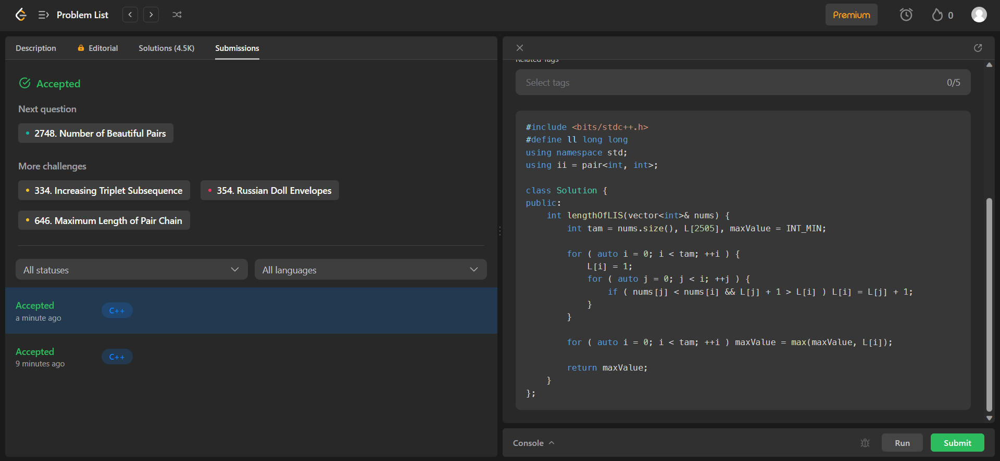
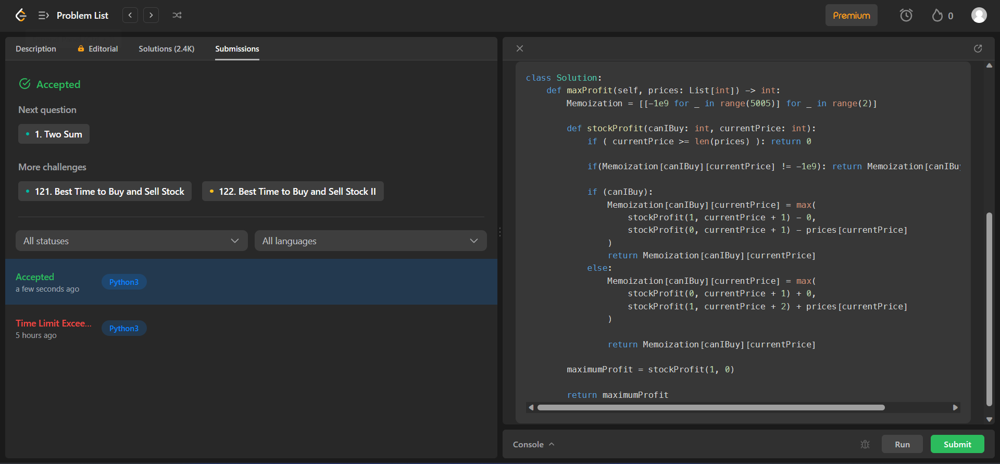
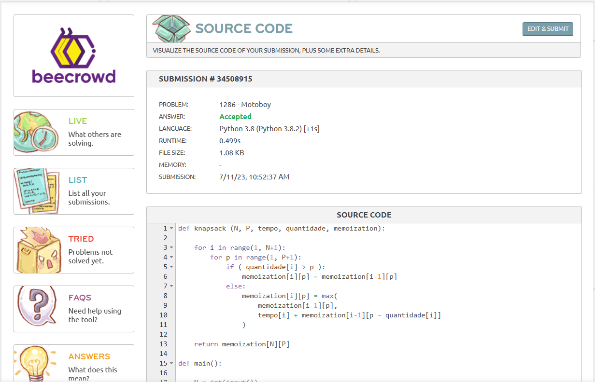
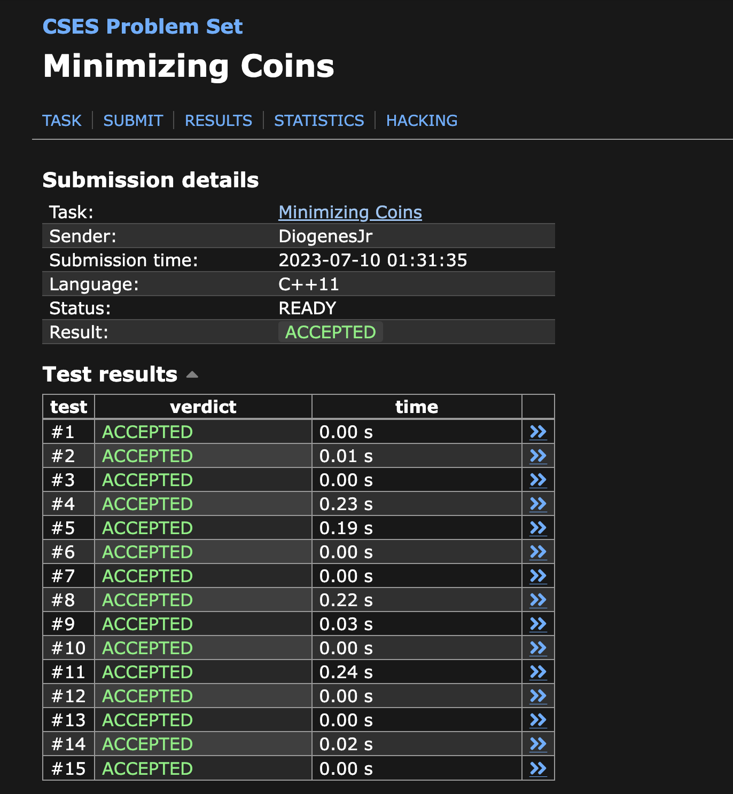
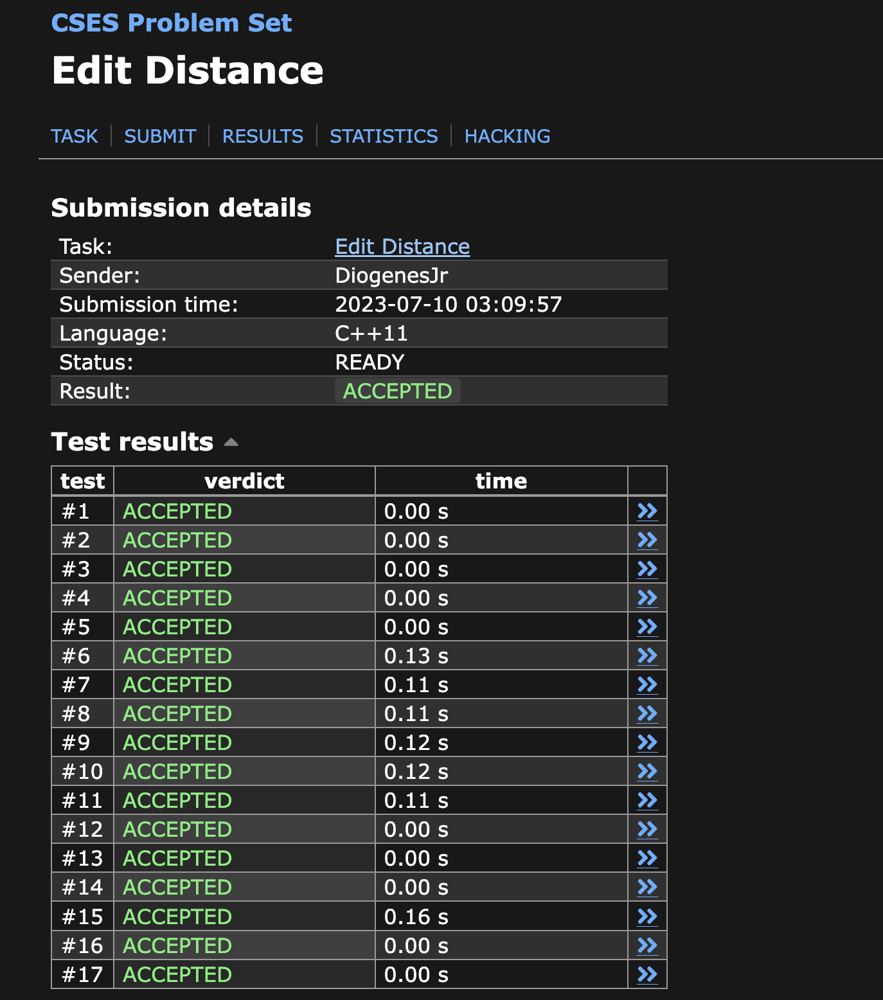

# Dynamic Exercises

**Número da Lista**: Dupla 14 da Turma 02<br>
**Conteúdo da Disciplina**: Dynamic Programming<br>

## Alunos

|Matrícula | Aluno |
| -- | -- |
| 19/0105267  |  Diógenes Dantas Lélis Júnior |
| 20/0018167  |  Gabriel Mariano da Silva |

## Sobre

Este projeto teve como foco a resolução de problemas de **Programação Dinâmica** (*Dynamic Programming*) nas plataformas **LeetCode**, **BeeCrowd** e **CodeForces**.

## Apresentação

Caso queira ver a apresentação do projeto desenvolvido por parte dos integrantes da equipe, basta acessar o [**LINK DO YOUTUBE**](https://www.youtube.com) ou então baixar o vídeo completo no [**LINK DO VÍDEO**](https://www.youtube.com).

## Screenshots

### [300] *Longest Increasing Subsequence*

[**Link do Problema**](https://leetcode.com/problems/longest-increasing-subsequence/)

[**Resposta Comentada**](./exercises/300_LongestIncreasingSubsequence/commented/300_LongestIncreasingSubsequence.md)



### [309] *Best Time to Buy and Sell Stock with Cooldown*

[**Link do Problema**](https://leetcode.com/problems/best-time-to-buy-and-sell-stock-with-cooldown/)

[**Resposta Comentada**](./exercises/309_BestTimeBuySellStockCooldown/commented/309_BestTimeBuySellStockCooldown.md)



### [1286] *Motoboy*

[**Link do Problema**](https://www.beecrowd.com.br/judge/en/problems/view/1286)

[**Resposta Comentada**](./exercises/1286_Motoboy/commented/1286_Motoboy.md)



### [CSES] *Minimizing Coins*

[**Link do Problema**](https://cses.fi/problemset/task/1634)

[**Resposta Comentada**](./exercises/CSES_MinimizingCoins/commented/cses_minimizingcoins.md)



### [CSES] *Edit Distance*

[**Link do Problema**](https://cses.fi/problemset/task/1639/)

[**Resposta Comentada**](./exercises/CSES_EditDistance/commented/cses_editdistance.md)



## Instalação

**Linguagens**: *C++* (C++17) e *Python 3.8*<br>
**Compilador**: *G++* <br>

* Caso não tenha o compilador *G++* ou o *Python 3.8* instalados, veja a seção *Outros* no tópico *Compilador*.

## Execução

Alguns dos algoritmos apresentados foram executados nas respectivas plataformas de onde foram disponibilizados, conforme relatado na subseção *"Execução em máquina local"* da seção *"Outros"* (veja abaixo).

Todavia, caso deseje executar os algoritmos em sua máquina, siga os passos:

Primeiramente, clone o repositório em sua máquina:

```
git clone git@github.com:projeto-de-algoritmos/Final_DynamicExercises.git
```

Agora, entre na pasta do projeto e então entre na pasta *exercises*, onde as pastas para cada exercício estão:

```
cd Final_DynamicExercises/exercises
```

Então, entre na pasta do algoritmo do exercício desejado:

```
cd *nome da pasta do algoritmo desejado*
```

A partir desse passo, existem duas alternativas de execução (caso o algoritmo seja passível de execução em máquina local - ver seção **Outros**): a execução de algoritmos desenvolvidos em *Python* e a execução de algoritmos desenvolvidos em *C++*:

### Algoritmos em C++

Insira o caso de teste no arquivo *in* (caso não exista, basta criar um arquivo sem extensão com nome *in*), compile o algoritmo e o execute:

```
g++ *nome_do_algoritmo*.cpp -o Exer

./Exer < in
```

### Algoritmos em *Python*

Insira o caso de teste no arquivo *in* (caso não exista, basta criar um arquivo sem extensão com nome *in*) e execute o algoritmo:

```
python3 *nome_do_algoritmo*.py < in
```

## Outros

*Aviso de Referência:* os conteúdos presentes nessa seção são similares aos disponibilizados na seção de mesmo nome do projeto desenvolvido por esta equipe para dividir e conquistar (ver [DeC_DivisiveExercises](https://github.com/projeto-de-algoritmos/DeC_DivisiveExercises)). Tal uso se deu devido à igualdade das situações que podem existir durante a execução de ambos os projetos, haja vista que estes tratam da resolução de exercícios sobre os respectivos assuntos.

### Execução em máquina local

Destaca-se que os algoritmos desenvolvidos para a plataforma *LeetCode* devem ser executados na mesma e não em máquina local devido à sua estrutura. Para tal, basta entrar na página do exercício em questão, colar o código original e clicar em *Run* para executar os casos de teste disponibilizados.

### Compilador

Alguns dos algoritmos foram desenvolvidos em **C++**. Para compilar e executar seus arquivos, é necessário ter o compilador **G++** instalado. Para tal, basta seguir as instruções para as plataformas [*Linux*](https://linuxhint.com/install-and-use-g-on-ubuntu/) e [*Windows*](https://www.freecodecamp.org/news/how-to-install-c-and-cpp-compiler-on-windows/).

Todavia, também é possível executar tais algoritmos nas plataformas de onde os exercícios foram retirados ou por ambientes de programação on-line, como, por exemplo, o [*OnlineGDB*](https://www.onlinegdb.com/).

Para os algoritmos desenvolvidos em **Python**, é necessário ter o [**Python 3.8**](https://www.python.org/downloads/release/python-3810/) instalado em sua máquina. Também é possível executar tais algoritmos em ambientes on-line de programação, como o supracitado [*OnlineGDB*](https://www.onlinegdb.com/).
